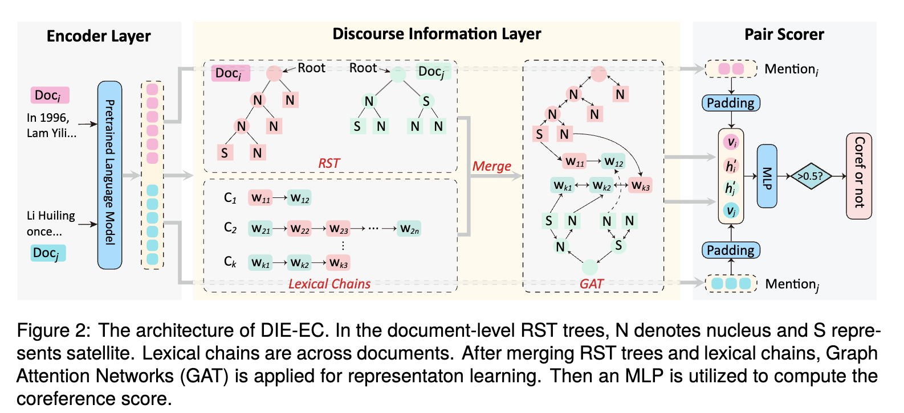

## DIE-EC
project for paper [Enhancing Cross-Document Event Coreference Resolution by Discourse Structure and Semantic Information](https://aclanthology.org/2024.lrec-main.523/) (LREC-COLING 2024))
<p align="center">
    <br>
    
    <br>
</p>

## Prerequisites
- Python 3.8 
- `#>pip install -r requirements.txt`
- `#>export PYTHONPATH=<ROOT_PROJECT_FOLDER>`

## Preprocessing
The main train process require the mentions pairs and embeddings from each set.<br/>

#### constrcut RST trees and Lexical chains
    We first construct RST tress for each documents, When generate mention pair, we construct cross-document lexical chains.
#### WEC-Eng and WEC-Zh
Since WEC-Eng/WEC-Zh train set contains many mentions, generating all negative pairs is very resource and time consuming.
To that end, we added a control for the negative:positive ratio.<br/> 
 ```
#>python src/preprocess_gen_pairs.py
```

### Generate Embeddings
To generate the embeddings for WEC-Eng/WEC-Zh run the following script and provide the slit files location, for example:<br/>
```
#>python src/preprocess_embed.py 
```

### Initialize node
We use the generated embeddings to initialize node<br/>
#>python src/preprocess_edu_embed.py 

## Training
See `train.py` file header for the complete set of script parameters.
Model file will be saved at output folder (for each iteration that improves).

- For training over WEC-Eng/WEC-Zh:<br/>
```
#> python src/train.py
```
## Inference
```
#> python src/inference.py
```

## Cluster
```
#> python src/custer.py
```
